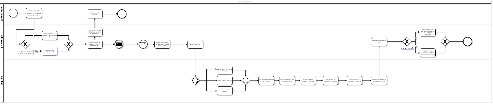
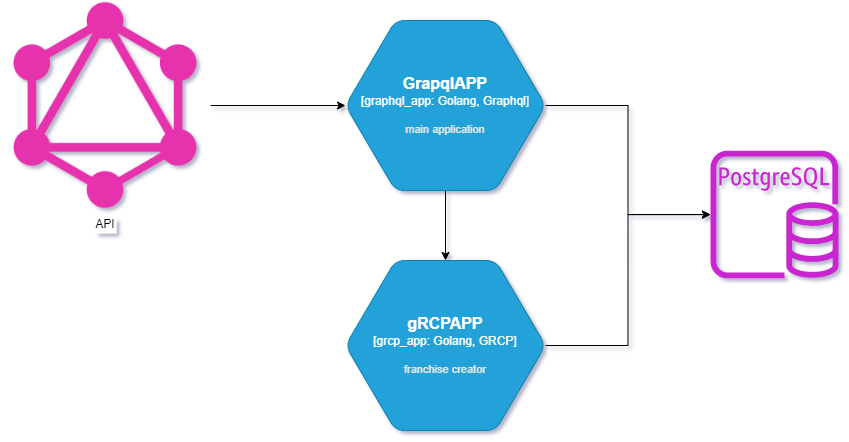
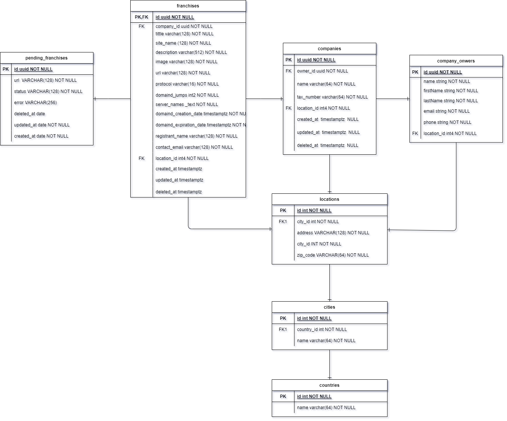

# ClubHUB Franchises

Technical test for club hub, a dockerized application to manage company franchises.

## Deployment
Run the next command from the project root with docker and docker compose insalled then wait until GraphqlAPP is serving in localhost:8080

```bash
docker-compose -f ./scripts/docker/compose.yml up --build
```
## API Documentation

The main API was built with graphql, you can use the playground in localhost:8080.

### Schemas
The following are the schemas to interact with the API data.

```graphql
type Franchise {
  id: ID!
  title: String!
  name: String!
  url: String!
  location: Location!
}

type Company {
  id: ID!
  owner: CompanyOwner!
  information: CompanyInformation!
  franchises: [Franchise!]!
}

type CompanyInformation {
  name: String!
  tax_number: String!
  location: Location!
}

type CompanyOwner {
  id: ID!
  name: String!
  firstName: String!
  lastName: String!
  contact: CompanyOwnerContact!
}

type CompanyOwnerContact {
  email: String!
  phone: String!
  location: Location!
}

type Location {
  zip_code: String!
  adress: String!
  city: String!
  country: String!
}
```

### Queries
The following are the queries that can be performed in the API to retrieve data.
```graphql
type Query {
  findFranchises(criteria: FindFranchisesCriteria): [Franchise!]!
}
input FindFranchisesCriteria {
  name: String
  company: String
  city: String
  country: String
}

```
* findFranchises: consult the fanchises by a optional concept defined in the FindFranchisesCriteria, you can filter with any concepts like name = clubhub, country=mexico. Returns the franchises that meet the criterial

### Mutations
The following are the mutation that can be performed in the API to create or uptate data.
```graphql

type Mutation {
  createFranchise(input: CreateFranchiseInput!): CreatedFranchise!
  updateFranchise(input: UpdateFranchiseInput!): Franchise!
}

input CreateFranchiseInput {
  url: String!
}

input UpdateFranchiseInput {
  id: ID!
  title: String
  name: String
  location: UpdateLocationInput
}

input UpdateLocationInput {
  zip_code: String
  adress: String
  city: String
  country: String
}

type CreatedFranchise {
  id: ID!
  url: String!
}

```

* createFranchise: creates a franchise from a given url

* updateFranchise: updates franchise data from any UpdateFranchiseInput optional arguments

## Diagrams
### Flow
#### Creation

#### Update
1. The client generates the request.
2. The GraphQL API generates a new object for the requested field and updates the IDs referencing this object if necessary.
3. It responds with the updated franchise object.

#### Find by criterial
1. The client generates the request.
2. the GraphQL API performs a db query that obtains all the objects that matches all the criterials
3. returns the objects list to the client
### Architecture

### Data Model

